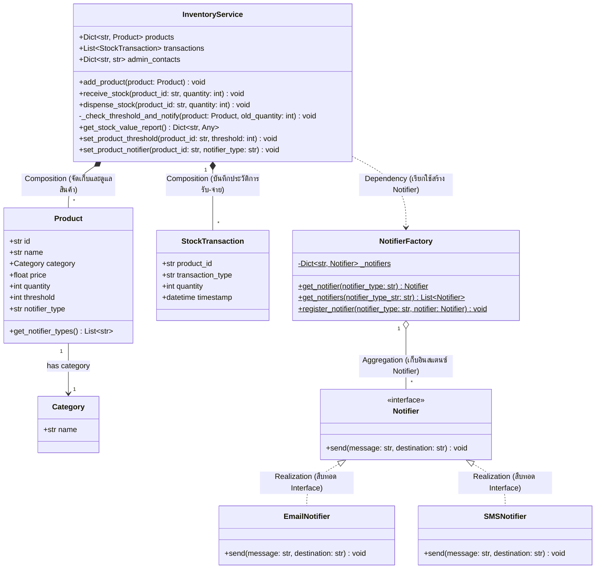

# Class Diagram - Inventory System (Omega Team)

```mermaid
classDiagram
    direction TB

    class Category {
        +str name
    }

    class Product {
        +str id
        +str name
        +Category category
        +float price
        +int quantity
        +int threshold
        +str notifier_type
        +get_notifier_types() List~str~
    }

    class StockTransaction {
        +str product_id
        +str transaction_type
        +int quantity
        +datetime timestamp
    }

    class Notifier {
        <<interface>>
        +send(message: str, destination: str) void
    }

    class EmailNotifier {
        +send(message: str, destination: str) void
    }

    class SMSNotifier {
        +send(message: str, destination: str) void
    }

    class NotifierFactory {
        -Dict~str, Notifier~ _notifiers$
        +get_notifier(notifier_type: str) Notifier$
        +get_notifiers(notifier_type_str: str) List~Notifier~$
        +register_notifier(notifier_type: str, notifier: Notifier) void$
    }

    class InventoryService {
        +Dict~str, Product~ products
        +List~StockTransaction~ transactions
        +Dict~str, str~ admin_contacts
        +add_product(product: Product) void
        +receive_stock(product_id: str, quantity: int) void
        +dispense_stock(product_id: str, quantity: int) void
        -_check_threshold_and_notify(product: Product, old_quantity: int) void
        +get_stock_value_report() Dict~str, Any~
        +set_product_threshold(product_id: str, threshold: int) void
        +set_product_notifier(product_id: str, notifier_type: str) void
    }

    %% ความสัมพันธ์ (Relationships)
    Product "1" --> "1" Category : has category
    InventoryService "1" *-- "*" Product : Composition (จัดเก็บและดูแลสินค้า)
    InventoryService "1" *-- "*" StockTransaction : Composition (บันทึกประวัติการรับ-จ่าย)
    
    Notifier <|.. EmailNotifier : Realization (สืบทอด Interface)
    Notifier <|.. SMSNotifier : Realization (สืบทอด Interface)
    
    NotifierFactory "1" o-- "*" Notifier : Aggregation (เก็บอินสแตนซ์ Notifier)
    InventoryService ..> NotifierFactory : Dependency (เรียกใช้สร้าง Notifier)
```
