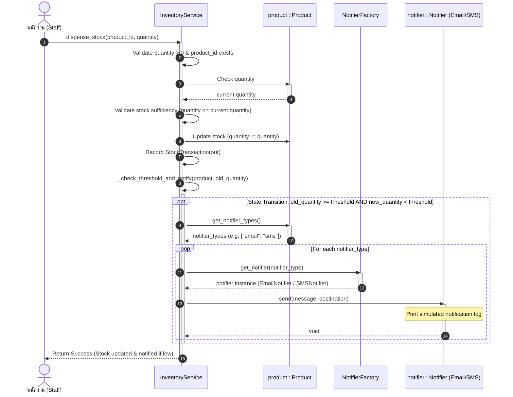

# Sequence Diagram - Low Stock Notification Flow (Step 8)

```mermaid
sequenceDiagram
    autonumber
    actor Staff as พนักงาน (Staff)
    participant Service as InventoryService
    participant Prod as product : Product
    participant Factory as NotifierFactory
    participant Notifier as notifier : Notifier (Email/SMS)

    Staff->>Service: dispense_stock(product_id, quantity)
    activate Service

    Service->>Service: Validate quantity > 0 & product_id exists

    Service->>Prod: Check quantity
    activate Prod
    Prod-->>Service: current quantity
    deactivate Prod

    Service->>Service: Validate stock sufficiency (quantity <= current quantity)

    Service->>Prod: Update stock (quantity -= quantity)
    Service->>Service: Record StockTransaction(out)

    Service->>Service: _check_threshold_and_notify(product, old_quantity)
    activate Service
    
    opt State Transition: old_quantity >= threshold AND new_quantity < threshold
        Service->>Prod: get_notifier_types()
        activate Prod
        Prod-->>Service: notifier_types (e.g. ["email", "sms"])
        deactivate Prod

        loop For each notifier_type
            Service->>Factory: get_notifier(notifier_type)
            activate Factory
            Factory-->>Service: notifier instance (EmailNotifier / SMSNotifier)
            deactivate Factory

            Service->>Notifier: send(message, destination)
            activate Notifier
            Note over Notifier: Print simulated notification log
            Notifier-->>Service: void
            deactivate Notifier
        end
    end

    deactivate Service
    Service-->>Staff: Return Success (Stock updated & notified if low)
    deactivate Service
```
