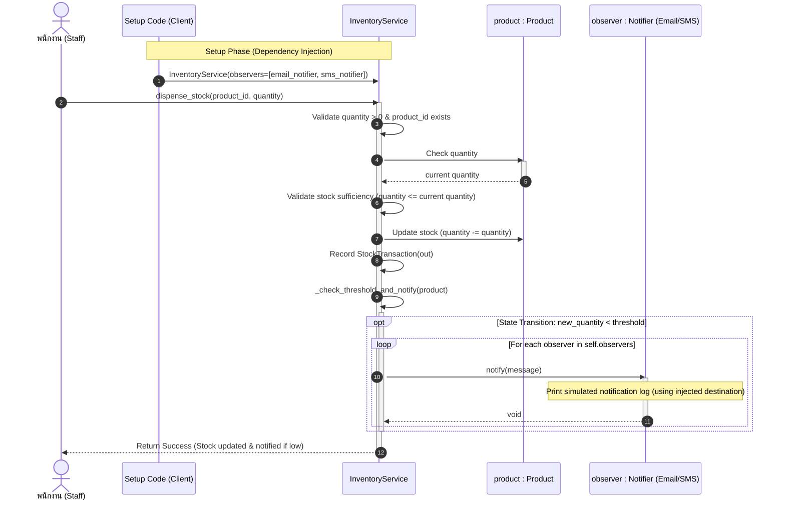

# Sequence Diagram - Low Stock Notification Flow (Observer Pattern)

```mermaid
sequenceDiagram
    autonumber
    actor Staff as พนักงาน (Staff)
    participant Setup as Setup Code (Client)
    participant Service as InventoryService
    participant Prod as product : Product
    participant Notifier as observer : Notifier (Email/SMS)

    Note over Setup, Service: Setup Phase (Dependency Injection)
    Setup->>Service: InventoryService(observers=[email_notifier, sms_notifier])
    activate Setup
    deactivate Setup

    Staff->>Service: dispense_stock(product_id, quantity)
    activate Service

    Service->>Service: Validate quantity > 0 & product_id exists

    Service->>Prod: Check quantity
    activate Prod
    Prod-->>Service: current quantity
    deactivate Prod

    Service->>Service: Validate stock sufficiency (quantity <= current quantity)

    Service->>Prod: Update stock (quantity -= quantity)
    Service->>Service: Record StockTransaction(out)

    Service->>Service: _check_threshold_and_notify(product)
    activate Service
    
    opt State Transition: new_quantity < threshold
        loop For each observer in self.observers
            Service->>Notifier: notify(message)
            activate Notifier
            Note over Notifier: Print simulated notification log (using injected destination)
            Notifier-->>Service: void
            deactivate Notifier
        end
    end

    deactivate Service
    Service-->>Staff: Return Success (Stock updated & notified if low)
    deactivate Service
```
