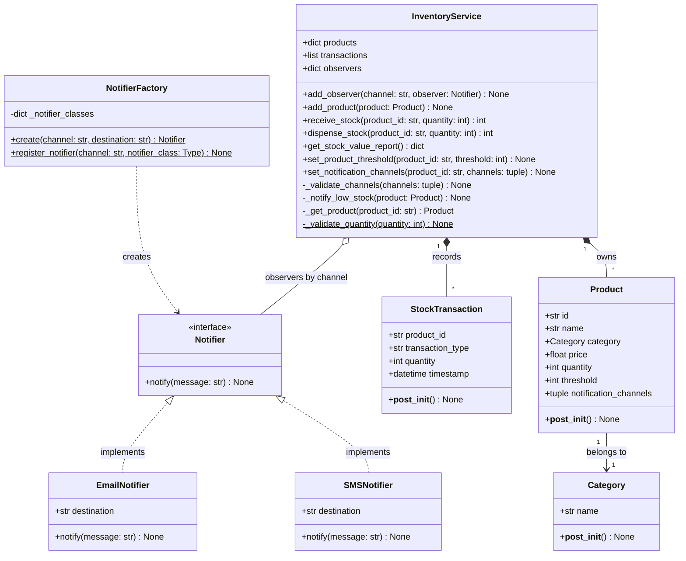

# Class Diagram — Inventory SDD

```mermaid
classDiagram
    direction TB

    class Category {
        +str name
        +__post_init__() None
    }
    class Product {
        +str id
        +str name
        +Category category
        +float price
        +int quantity
        +int threshold
        +tuple notification_channels
        +__post_init__() None
    }
    class StockTransaction {
        +str product_id
        +str transaction_type
        +int quantity
        +datetime timestamp
        +__post_init__() None
    }
    class Notifier {
        <<interface>>
        +notify(message: str) None
    }
    class EmailNotifier {
        +str destination
        +notify(message: str) None
    }
    class SMSNotifier {
        +str destination
        +notify(message: str) None
    }
    class NotifierFactory {
        -dict _notifier_classes
        +create(channel: str, destination: str)$ Notifier
        +register_notifier(channel: str, notifier_class: Type)$ None
    }
    class InventoryService {
        +dict products
        +list transactions
        +dict observers
        +add_observer(channel: str, observer: Notifier) None
        +add_product(product: Product) None
        +receive_stock(product_id: str, quantity: int) int
        +dispense_stock(product_id: str, quantity: int) int
        +get_stock_value_report() dict
        +set_product_threshold(product_id: str, threshold: int) None
        +set_notification_channels(product_id: str, channels: tuple) None
        -_validate_channels(channels: tuple) None
        -_notify_low_stock(product: Product) None
        -_get_product(product_id: str) Product
        -_validate_quantity(quantity: int)$ None
    }
    Product "1" --> "1" Category : belongs to
    InventoryService "1" *-- "*" Product : owns
    InventoryService "1" *-- "*" StockTransaction : records
    Notifier <|.. EmailNotifier : implements
    Notifier <|.. SMSNotifier : implements
    NotifierFactory ..> Notifier : creates
    InventoryService o-- "*" Notifier : observers by channel
```
