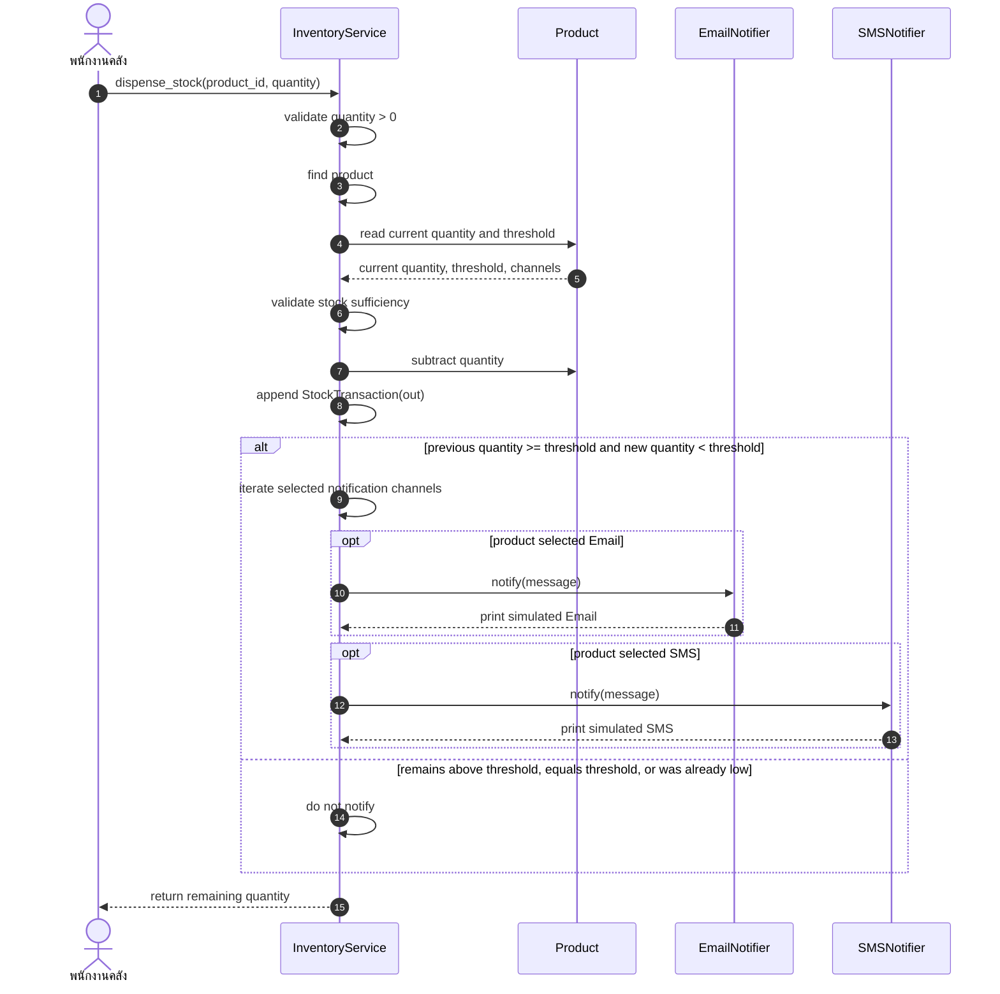

# Sequence Diagram — Dispense Across the Low-Stock Threshold

```mermaid
sequenceDiagram
    autonumber
    actor Staff as พนักงานคลัง
    participant Service as InventoryService
    participant Product as Product
    participant Email as EmailNotifier
    participant SMS as SMSNotifier

    Staff->>Service: dispense_stock(product_id, quantity)
    Service->>Service: validate quantity > 0
    Service->>Service: find product
    Service->>Product: read current quantity and threshold
    Product-->>Service: current quantity, threshold, channels
    Service->>Service: validate stock sufficiency
    Service->>Product: subtract quantity
    Service->>Service: append StockTransaction(out)
    alt previous quantity >= threshold and new quantity < threshold
        Service->>Service: iterate selected notification channels
        opt product selected Email
            Service->>Email: notify(message)
            Email-->>Service: print simulated Email
        end
        opt product selected SMS
            Service->>SMS: notify(message)
            SMS-->>Service: print simulated SMS
        end
    else remains above threshold, equals threshold, or was already low
        Service->>Service: do not notify
    end
    Service-->>Staff: return remaining quantity
```
